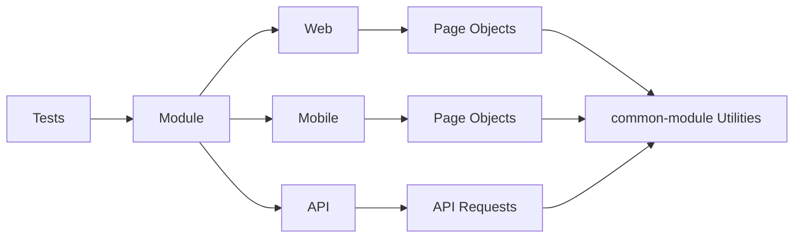

# Automation Project 🚀

[](https://maven.apache.org/)
[](https://www.oracle.com/java/)
[](LICENSE)

A **multi-module Maven automation project** supporting **Web**, **Mobile**, and **API** testing. Designed for *
*modularity**, **scalability**, and **reusability**.

---

## Project Structure

```
automation-project
│
├─ pom.xml ← Parent POM
├─ jenkinsFile 
│ 
├─ common-module
│   ├─ pom.xml
│   ├─ jenkinsFile
│   ├─ README.md
│   └─ src/main/java/com/common
│
├─ web-module
│   ├─ pom.xml
│   ├─ jenkinsFile
│   ├─ README.md
│   ├─ src/test/java/com/company/web
│   ├─ tests/LoginTest.java
│   └─ pageobjects/LoginPage.java
│
├─ mobile-module
│   ├─ pom.xml
│   ├─ jenkinsFile
│   ├─ README.md
│   ├─ src/test/java/com/company/mobile
│   ├─ tests/LoginTest.java
│   └─ pageobjects/LoginPage.java
│
└─ api-module
    ├─ pom.xml
    ├─ jenkinsFile
    └─ src/test/java/com/company/api
    └─ tests/UserAPITest.java
```

---

```yaml
## Module Overview

### 1️⃣ common-module

Contains reusable utilities for all modules:

  - `ConfigReader.java` – Reads environment properties.
  - `LoggerTest.java` – Logging examples.

  **Sample Usage:**

  ```java
  String baseUrl = ConfigReader.getProperty("base.url");
  Logger.

info("Base URL: "+baseUrl);
```

---

2️⃣ web-module

Contains web UI tests and page objects.

Example Page Object:

```java
public class LoginPage {
    private WebDriver driver;

    public LoginPage(WebDriver driver) {
        this.driver = driver;
    }

    public void enterUsername(String username) {
        driver.findElement(By.id("username")).sendKeys(username);
    }

    public void enterPassword(String password) {
        driver.findElement(By.id("password")).sendKeys(password);
    }

    public void clickLogin() {
        driver.findElement(By.id("loginBtn")).click();
    }
}
```

Sample Test:

```java

@Test
public void testLogin() {
    LoginPage loginPage = new LoginPage(driver);
    loginPage.enterUsername("user");
    loginPage.enterPassword("pass");
    loginPage.clickLogin();
}

```

---

3️⃣ mobile-module

Contains mobile UI tests for Android/iOS using Appium.

Sample Page Object:

```java
public class LoginPage {
    private AppiumDriver driver;

    public LoginPage(AppiumDriver driver) {
        this.driver = driver;
    }

    public void enterUsername(String username) {
        driver.findElement(By.id("username")).sendKeys(username);
    }

    public void enterPassword(String password) {
        driver.findElement(By.id("password")).sendKeys(password);
    }

    public void tapLogin() {
        driver.findElement(By.id("loginBtn")).click();
    }
}

```

---

4️⃣ api-module

Contains API tests using REST-assured.

Sample API Test:

```java

@Test
public void getUserTest() {
    given()
            .baseUri(ConfigReader.getProperty("api.baseUrl"))
            .when()
            .get("/users/1")
            .then()
            .statusCode(200)
            .body("id", equalTo(1));
}

```

---

## Running Tests

```bash
  # Web 🌐
  mvn test -pl web-module

  # Mobile 📱
  mvn test -pl mobile-module

  # API 🔗
  mvn test -pl api-module

  # All Modules 🏗️
  mvn test
```


---


## Configuration

Located in common-module/src/main/resources.

ConfigReader loads environment-specific settings (URLs, credentials, timeouts).

---

## Project Flow Diagram


---

## Logging

Centralized logging in common-module.

Use LoggerTest.java as reference for consistent reporting.

---

## Contributing

Fork and create feature branches.

Write tests for new features.

Follow coding conventions and module structure.

Submit PRs with detailed descriptions.
